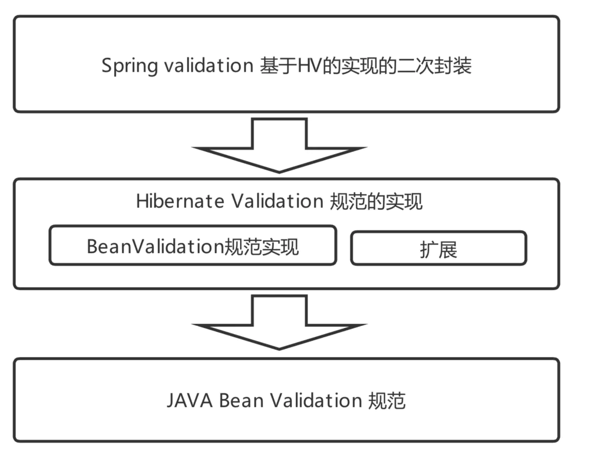

Bean Validation 参数验证

1、Bean Validation是规范

1)、Bean Validation 、Hibernate Validation 、Spring Validation之间的关系

2)、Spring Validation整合了Hibernate Validation的基础上、以spring的方式对支持spring的应用提供入参和出参验证、比如MVC入参校验，方法级校验

